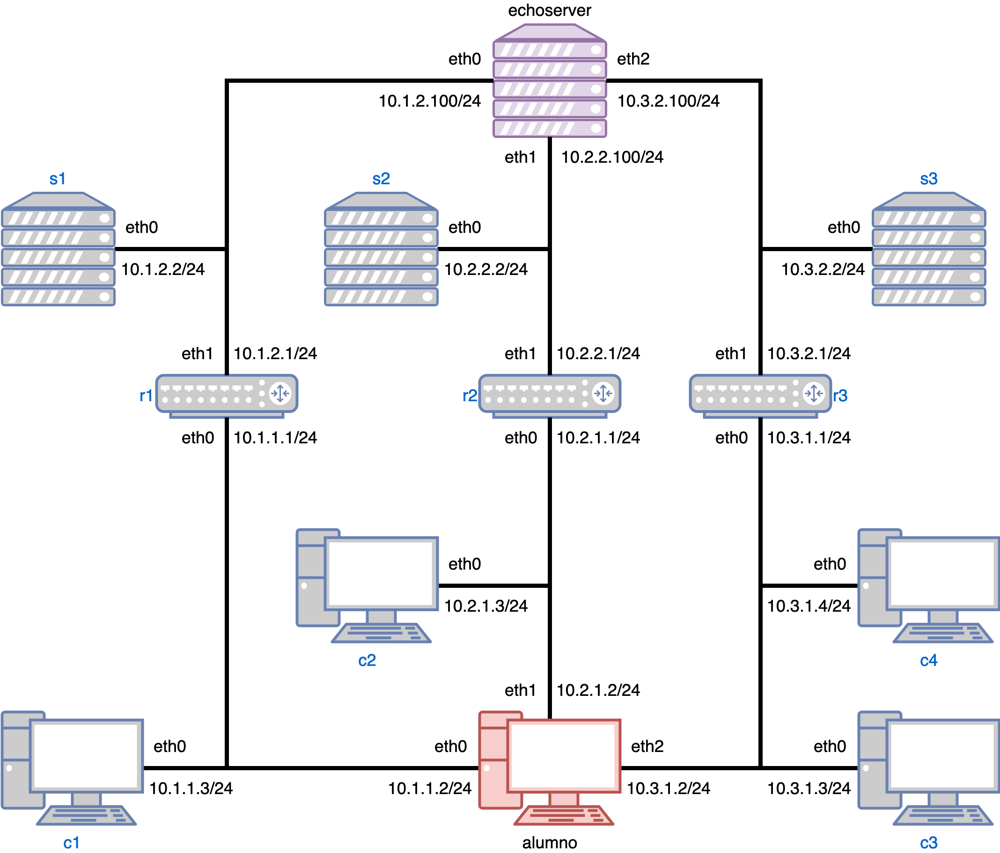

# Laboratorio 2

Este laboratorio consiste en un escenario con 9 hosts, tres routers, y seis enlaces distintos.
Usted deberá utilizar el host `alumno` para ejecutar su cliente UDP y conectarse al servidor eco a través de los tres enlaces salientes.
Deberá estudiar el comportamiento de su cliente al compartir enlace con distintos tipo de tráfico y presentar conclusiones al respecto.



## Cómo acceder a su código dentro de el host de Kathará

Archivos que usted coloque dentro de la carpeta `alumno` serán "montados" en una ubicación dentro del host de Kathará como si la carpeta correspondiera al directorio raíz del host.
Es decir, por ejemplo:

- `./alumno/archivo` fuera del host corresponde a `/archivo` dentro del host.
- `./alumno/aaa/bbb/ccc/archivo` fuera del host corresponde a `/aaa/bbb/ccc/archivo` dentro del host.

Se recomienda (pero no es obligación) que coloque su código en `./alumno/opt/Tarea3`, de tal manera que dentro del host pueda accederlo a través de `/opt/Tarea3`.

## Cómo inicializar este laboratorio

Para inicializar este laboratorio, ejecute los siguientes comandos en una terminal en este directorio:

```bash
# Actualice el código
$ git pull
# Verifique el funcionamiento correcto de Kathara.
# Si este comando falla, repítalo hasta que funcione.
$ kathara check
# Resetee el laboratorio a su configuración inicial.
$ kathara wipe -f
# Inicie el laboratorio.
# Puede que Kathará le pida actualizar las imágenes de Docker utilizadas, acepte.
$ kathara lstart
# Para finalizar el laboratorio.
$ kathara wipe -f
```
